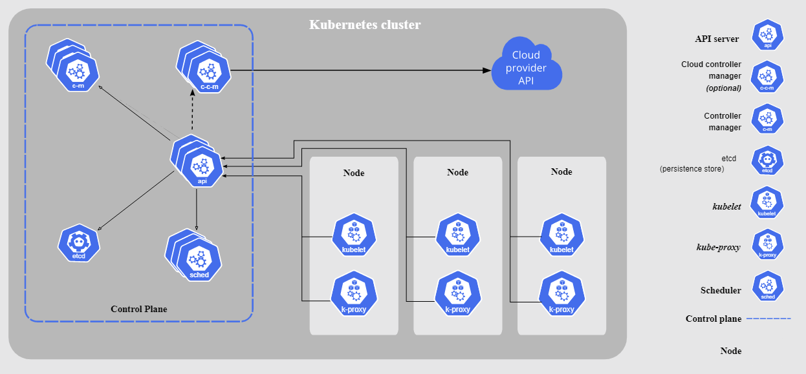

# Kubernetes in PROD

O projeto Kubernetes foi desenvolvido pela Google, em meados de 2014, para atuar como um orquestrador de contêineres para a empresa. O Kubernetes (k8s), cujo termo em Grego significa "timoneiro", é um projeto open source que conta com design e desenvolvimento baseados no projeto Borg, que também é da Google. Alguns outros produtos disponíveis no mercado, tais como o Apache Mesos e o Cloud Foundry, também surgiram a partir do projeto Borg.

## Alternativas do Kubernetes para estudos

Assim como os demais orquestradores disponíveis, o k8s também segue um modelo master/worker, constituindo assim um cluster, onde para seu funcionamento devem existir no mínimo três nós: o nó master, responsável (por padrão) pelo gerenciamento do cluster, e os demais como workers, executores das aplicações que queremos executar sobre esse cluster.

Embora exista a exigência de no mínimo três nós para a execução do k8s em um ambiente padrão, existem soluções para se executar o k8s em um único nó. Alguns exemplos são:

Kind: Uma ferramenta para execução de contêineres Docker que simulam o funcionamento de um cluster Kubernetes. É utilizado para fins didáticos, de desenvolvimento e testes. O Kind não deve ser utilizado para produção;

Minikube: ferramenta para implementar um cluster Kubernetes localmente com apenas um nó. Muito utilizado para fins didáticos, de desenvolvimento e testes. O Minikube não deve ser utilizado para produção;

MicroK8S: Desenvolvido pela Canonical, mesma empresa que desenvolve o Ubuntu. Pode ser utilizado em diversas distribuições e pode ser utilizado em ambientes de produção, em especial para Edge Computing e IoT (Internet of things);

k3s: Desenvolvido pela Rancher Labs, é um concorrente direto do MicroK8s, podendo ser executado inclusive em Raspberry Pi.

k0s: Desenvolvido pela Mirantis, mesma empresa que adquiriu a parte enterprise do Docker. É uma distribuição do Kubernetes com todos os recursos necessários para funcionar em um único binário, que proporciona uma simplicidade na instalação e manutenção do cluster. A pronúncia é correta é kay-zero-ess e tem por objetivo reduzir o esforço técnico e desgaste na instalação de um cluster Kubernetes, por isso o seu nome faz alusão a Zero Friction. O k0s pode ser utilizado em ambientes de produção

## Componentes do Kubernetes

## Contributing
Pull requests are welcome. For major changes, please open an issue first to discuss what you would like to change.

Please make sure to update tests as appropriate.

## License
GPL-3.0 license